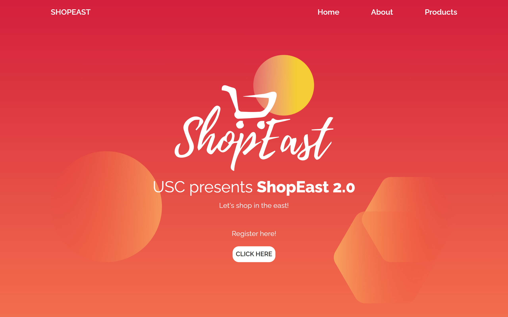

# ShopEast 2.0

3rd Place Winner in USC's ShopEast Website Design Competition. Developed using HTML, CSS, jQuery, and Bootstrap for responsive design and media queries. Aiding UE students in online selling during quarantine.

## Screenshots

## Demo

https://andimags.github.io/shopeast/

## 🚀 About Me
Backend developer with an IT degree, proficient in PHP (Laravel), CSS (Bootstrap), and JavaScript. Expert in API integration and database management, showcasing strong problem-solving skills. Passionate about continuous learning and adaptable to emerging technologies. Let's code the future! 🚀💻

